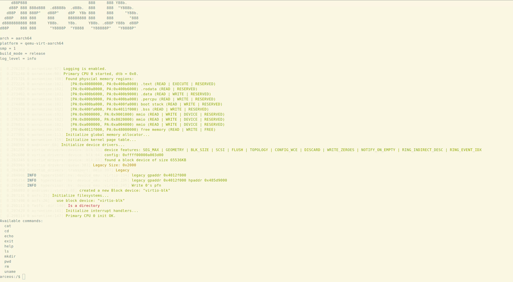
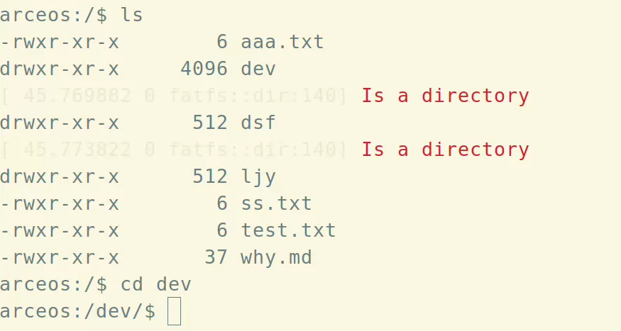

# 验证qemu上将ArceOS在Hypervisor上运行

1.  将所需文件Clone到本地
    
    ```shell
    git clone git@github.com:KarmaD7/rHyper.git
    ```

2.  编译运行
    
    ```shell
    # rHyper/hypervisor目录下
    make run LOG=info SMP=2 GUEST=arceos NET=y FS=y
    ```

    

3.  如果上一步成功，此时运行`ArceOS`的终端/`tmux`的窗口应显示进入`ArceOS`的终端,测试相关命令
    
    ```shell
    ls
    cd dev
    ...
    ```

    

    正常显示则说明验证成功。

---

注意:
  1.    在进行第二步编译运行的时候，请确保你的环境变量`PATH`中已经添加了`(your_path)/qemu/build`
  2.    如果提示找不到`qemu_system_$(ARCH)`如`qemu_system_aarch64`，请确保你的`qemu`编译时使用了你选择的架构所对应的参数